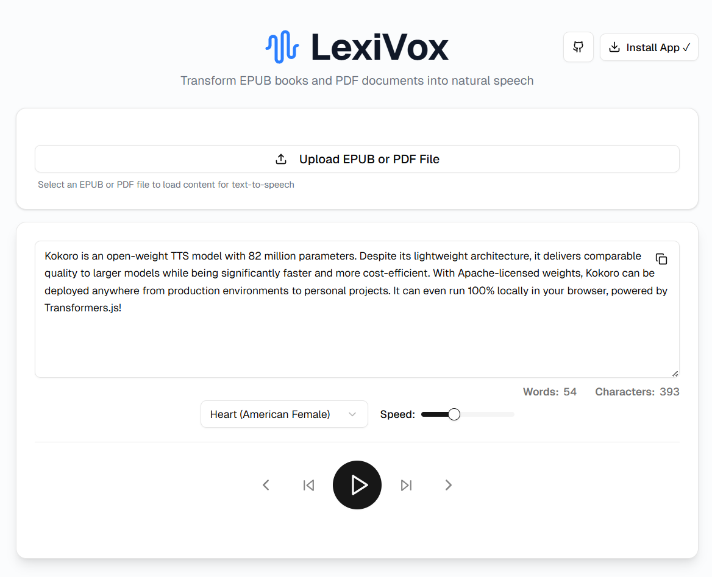

# LexiVox

Transform EPUB books and PDF documents into natural speech directly in your browser! Built with [🤗 Transformers.js](https://huggingface.co/docs/transformers.js) and powered by the Kokoro TTS model.



🔗 **Live Demo**: [https://lexivox.dvaitatech.com/](https://lexivox.dvaitatech.com/)

## Features

- 📚 **EPUB & PDF Support** - Upload and read your favorite books and documents
- 🎯 **Chapter/Page Navigation** - Easy navigation through book chapters or PDF pages
- 🗣️ **Multiple Voices** - Choose from various voice options for personalized reading
- ⚡ **Offline Capable** - Progressive Web App that works offline once loaded
- 🎚️ **Speed Control** - Adjust reading speed to your preference
- 📱 **Responsive Design** - Works seamlessly on desktop and mobile devices
- 🔒 **Privacy-First** - All processing happens locally in your browser

## Technology

LexiVox uses the Kokoro TTS model (82M parameters) running entirely in the browser via Transformers.js, supporting both WebGPU and WASM backends for optimal performance.

## Running locally

1. Clone the repo and install dependencies:

   ```bash
   git clone https://github.com/DvaitaTech/LexiVox.git
   cd LexiVox
   npm install
   ```

2. Run the development server:

   ```bash
   npm run dev
   ```

3. Open the link (e.g., [http://localhost:5173/](http://localhost:5173/)) in your browser.

## Building for Production

```bash
npm run build
```

The production build will be available in the `dist` directory.

## License

This project is licensed under the Apache License 2.0 - see the LICENSE file for details.
